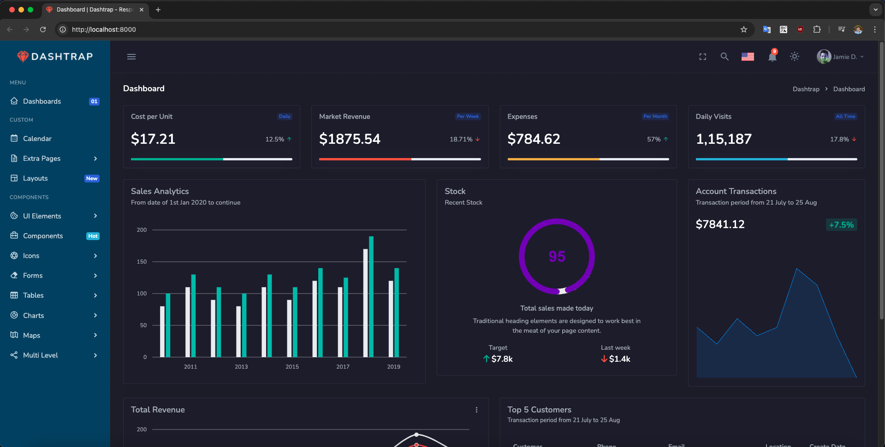
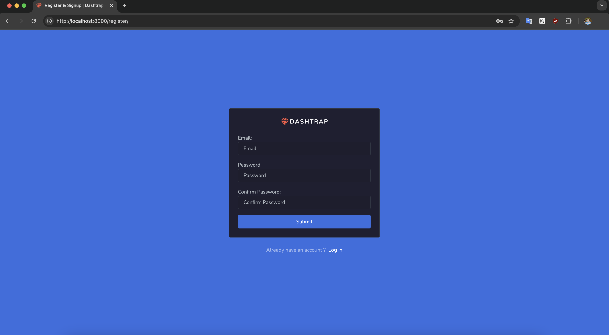
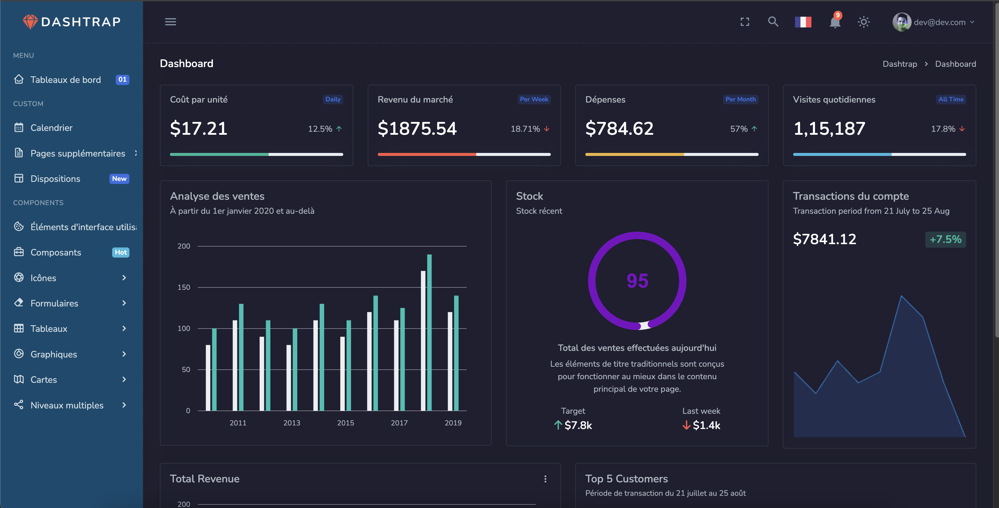
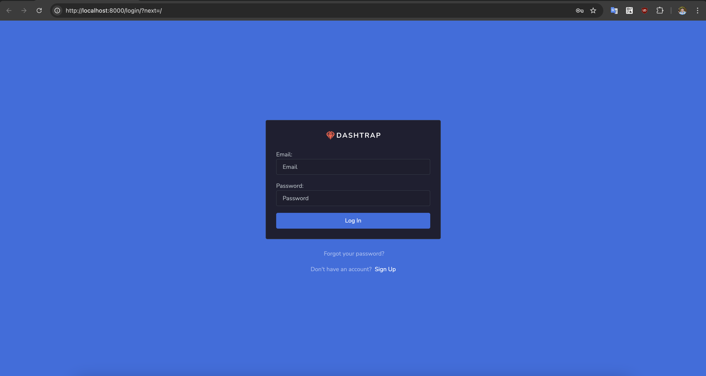

### Downloaded KIT `Dashtrap` and convert it into Django application ([link here](https://www.buzzerboysites.com/html_kits/dashtrap.zip))

# Screenshot
1. Register

2. Dashboard (English)

3. Dashboard after changing language (French)

4. Redirect Login page after logging out

